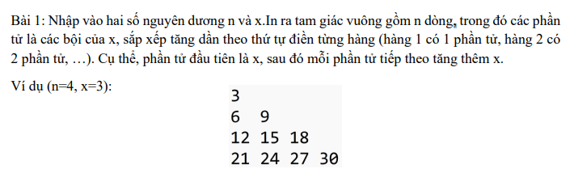
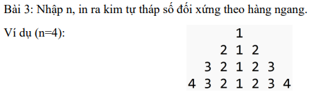
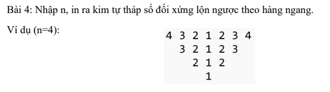
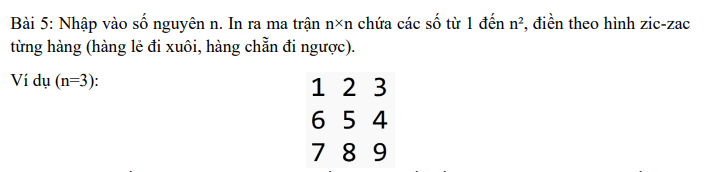
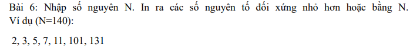
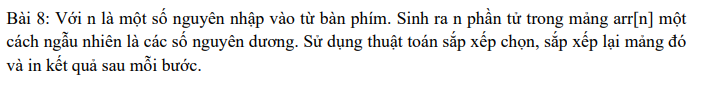
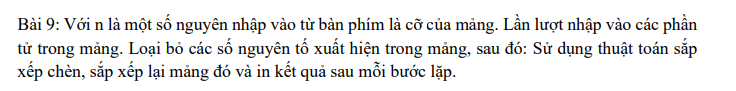
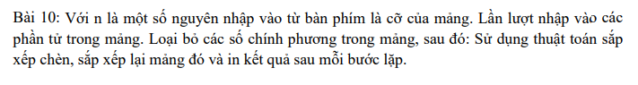

K <details> <summary><strong>(Click to expand B1)</strong></summary>

```python
n,x=map(int,input().split())
current=x
for i in range(0,n+1):
    row=[]
    for _ in range(i):
        row.append(current)
        current+=x
    print(*(row)) #* de bo cai dau ngoac vuong
```

```
C:\Users\qtitpc\Desktop\proj\python\class\learn>py 1.py
4 3

3
6 9
12 15 18
21 24 27 30

C:\Users\qtitpc\Desktop\proj\python\class\learn>py 1.py
5 6

6
12 18
24 30 36
42 48 54 60
66 72 78 84 90

C:\Users\qtitpc\Desktop\proj\python\class\learn>py 1.py
9 4

4
8 12
16 20 24
28 32 36 40
44 48 52 56 60
64 68 72 76 80 84
88 92 96 100 104 108 112
116 120 124 128 132 136 140 144
148 152 156 160 164 168 172 176 180
```

</details>

 <details> <summary><strong>(Click to expand B3)</strong></summary>

```python
def ma_tran_doi_xung(row, height):
    space="  "*(height-row)
    left=list(range(row,1,-1))
    right=list(range(2,row+1))
    full=left + [1] + right
    print(space+" ".join(map(str, full)))
n=int(input())
for i in range(1,n+1):
    ma_tran_doi_xung(i,n)
```
```
C:\Users\qtitpc\Desktop\proj\python\class\learn>py 3.py
4
      1
    2 1 2
  3 2 1 2 3
4 3 2 1 2 3 4

C:\Users\qtitpc\Desktop\proj\python\class\learn>py 3.py
6
          1
        2 1 2
      3 2 1 2 3
    4 3 2 1 2 3 4
  5 4 3 2 1 2 3 4 5
6 5 4 3 2 1 2 3 4 5 6

C:\Users\qtitpc\Desktop\proj\python\class\learn>py 3.py
1
1
```
</details>

 <details> <summary><strong>(Click to expand B4)</strong></summary>

```python
def ma_tran_doi_xung(row, height):
    space="  "*(height-row)
    left=list(range(row,1,-1))
    right=list(range(2,row+1))
    full=left + [1] + right
    print(space+" ".join(map(str, full)))
n=int(input())
for i in range(n,0,-1):
    ma_tran_doi_xung(i,n)

```
```
C:\Users\qtitpc\Desktop\proj\python\class\learn>py 4.py
3
3 2 1 2 3
  2 1 2
    1

C:\Users\qtitpc\Desktop\proj\python\class\learn>py 4.py
2
2 1 2
  1

C:\Users\qtitpc\Desktop\proj\python\class\learn>py 4.py
7
7 6 5 4 3 2 1 2 3 4 5 6 7
  6 5 4 3 2 1 2 3 4 5 6
    5 4 3 2 1 2 3 4 5
      4 3 2 1 2 3 4
        3 2 1 2 3
          2 1 2
            1
```

</details>

 <details> <summary><strong>(Click to expand B5)</strong></summary>

```python
n=int(input())
def zic_zac(x):
    val=1
    for i in range(x):
        row=[]
        for _ in range(x):
            row.append(val)
            val+=1
        if i%2!=0:
            row.reverse()
        print(*(row))
zic_zac(n)
```
```
C:\Users\qtitpc\Desktop\proj\python\class\learn>py 5.py
4
1 2 3 4
8 7 6 5
9 10 11 12
16 15 14 13

C:\Users\qtitpc\Desktop\proj\python\class\learn>py 5.py
3
1 2 3
6 5 4
7 8 9

C:\Users\qtitpc\Desktop\proj\python\class\learn>py 5.py
7
1 2 3 4 5 6 7
14 13 12 11 10 9 8
15 16 17 18 19 20 21
28 27 26 25 24 23 22
29 30 31 32 33 34 35
42 41 40 39 38 37 36
43 44 45 46 47 48 49
```
</details>

 <details> <summary><strong>(Click to expand B6)</strong></summary>

```python
n=int(input())
def prime(x):
    if x<2: return False
    for i in range(2, int(x**0.5) + 1):
        if x % i == 0: return False
    return True
def check_number(num):
    s=str(num)
    return s == s[::-1]
def final(n):
    res=[]
    for i in range(n+1):
        if prime(i) and check_number(i):
            res.append(i)
    print(", ".join(map(str, res)))
final(n)

```
```
C:\Users\qtitpc\Desktop\proj\python\class\learn>py 6.py
140
2, 3, 5, 7, 11, 101, 131
```
</details>

 <details> <summary><strong>(Click to expand B8)</strong></summary>

```python
import random as rd
n=int(input())
arr = [rd.randint(1, 100) for _ in range(n)]
print("ban dau`: ", arr)
for i in range(n):
    min_idx = i
    for j in range(i+1, n):
        if arr[j] < arr[min_idx]:
            min_idx = j
    arr[i], arr[min_idx] = arr[min_idx], arr[i]
    print(f"buoc {i+1}: {arr}")
```
```
PS C:\Users\qtitpc\Desktop\proj\python\class\learn> py 8.py
4
ban dau`:  [50, 61, 56, 7]
buoc 1: [7, 61, 56, 50]
buoc 2: [7, 50, 56, 61]
buoc 3: [7, 50, 56, 61]
buoc 4: [7, 50, 56, 61]
```
</details>

 <details> <summary><strong>(Click to expand)</strong></summary>

```python 

</details>

 <details> <summary><strong>(Click to expand)</strong></summary>

```python 

</details>